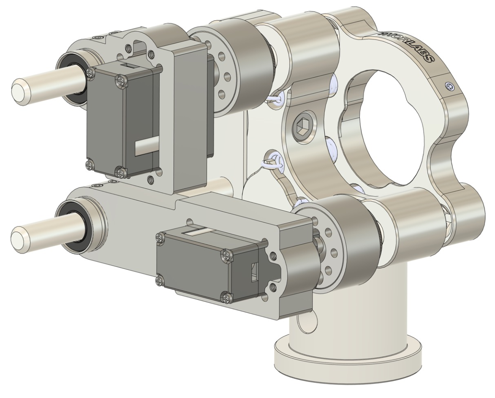

# servo_aligner

Algorithm and designs for controlling STS3032 servo motors, for automatic beam alignment.

**Features:**
- Packaged servo control api.
- [Spiral search](doc/spiral.md) based low-dimensional walking of coupled mirror knobs.
- Robust automated alignment with a model-free jacobian.

Full documentation (setup, hardware, the spiral/Jacobian optimization stack, applications) lives in [doc/](doc/README.md).