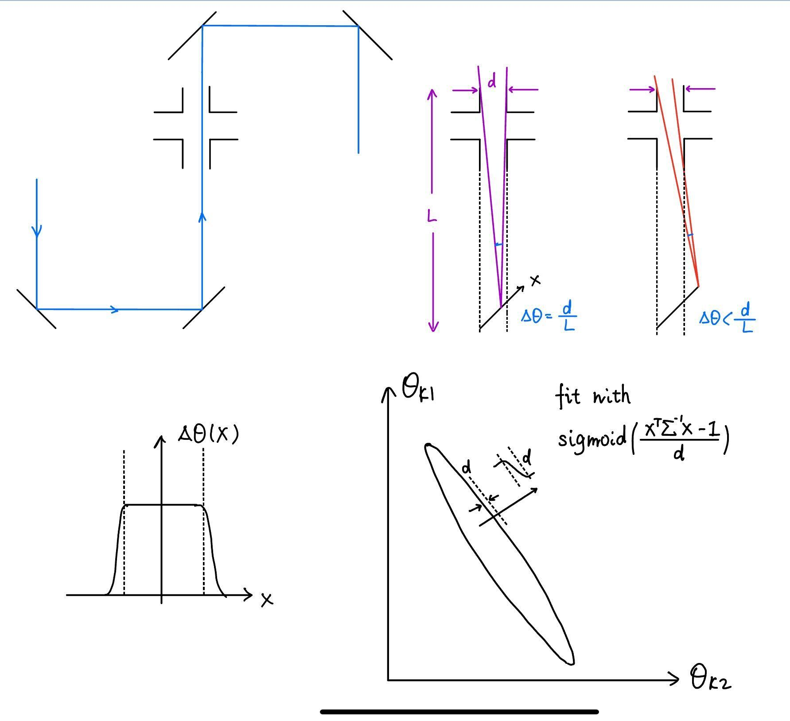
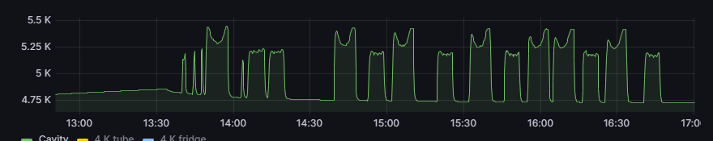
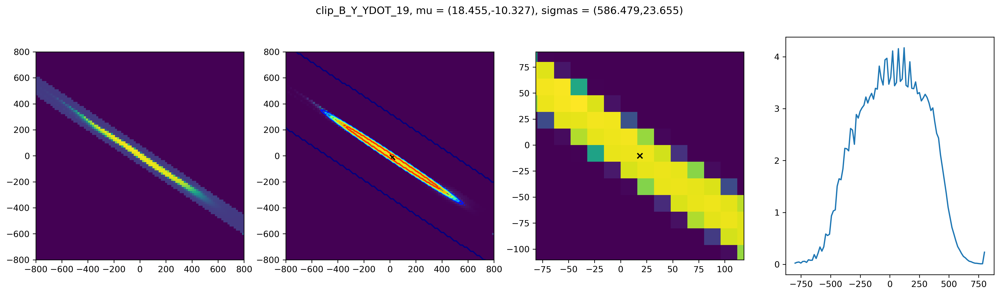
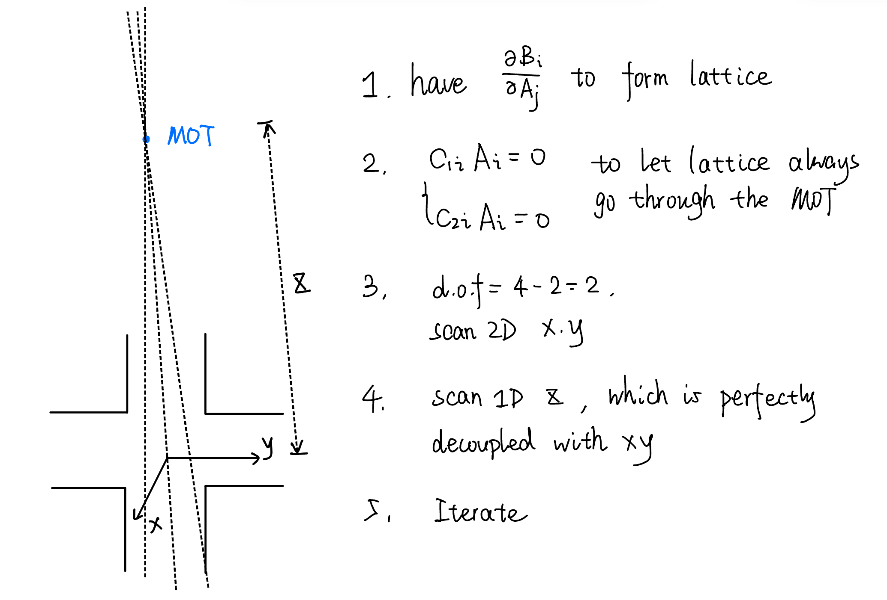

# Applications — Centering a Beam & Aligning the MOT

The two end-to-end procedures the aligner exists for:

1. **Center a beam on the cavity axis** — using the clip-scan / sigmoid-ellipse
   method (`servo-aligner clip-scan`).
2. **Align the MOT with the lattice** — using the calibrated
   [Jacobian](jacobian.md) to keep the lattice through the MOT while walking to
   the trap.

Both build on the [spiral optimizer](spiral.md) and the
[Jacobian calibration](jacobian.md); read those first for the machinery.

---

## Centering a beam on the cavity axis

### The idea: scan until the beam clips

We cannot read the beam position directly, but we **can** read how much power
makes it **through the cavity bore** (a small aperture of diameter `d`). As we
walk the beam across in a knob pair, transmission is **high while the beam clears
the aperture and drops to zero once it clips** the edge — a flat-topped plateau
with soft edges. The set of knob settings that still transmit forms a **2D
region whose center is the aligned position.**

Geometrically, the angular tolerance before clipping is `Δθ ≈ d/L` (aperture over
bore length); off-axis rays clip sooner, so the transmitting region is an
**elongated, tilted ellipse** in the knob-pair plane:

### The scan (`routines/clip_scan.py`, run via `servo-aligner clip-scan`)

`scan_and_analyze` runs a **2D raster** over a knob pair (`raster_2d` in
`servo_aligner/scan/raster.py`, boustrophedon/zig-zag order to minimize motor
travel), reading the photodiode at
each point. An optional **accept function** (configured as `clip_scan.accept_lines`
in the YAML) skips grid points far outside the
expected diagonal band, so the scan spends its time where the signal is.

The transmitting plateau is fit with a **smooth-Heaviside (sigmoid) ellipse**
rather than a Gaussian, because the profile is a flat-top, not a bump:

$$
I(\mathbf{x}) \;=\; A\;\operatorname{erfc}\!\Big(\frac{\mathbf{x}^\top\Sigma^{-1}\mathbf{x}-1}{w}\Big)
$$

(`gaussian_2d_smooth_heaviside` / `fit_gaussian_2d_smooth_heaviside` in
`servo_aligner/fitting.py`). The fit returns the **center `mu`** (the aligned knob
setting) and the covariance `Sigma` (orientation/size of the transmitting
region). The clip-scan routine then drives the knobs to `mu` and, if the intensity
there is meaningful, adopts it as the new `zero`.

Iterate this between knob pairs (`X_XDOT`, `Y_YDOT`, then a small `X_Y`) to walk
the beam onto the axis — the same iterate-between-pairs idea as the
[spiral alignment](spiral.md).

### The "fat tail" problem

In practice the transmitting ellipse is often **not symmetric** along its long
axis — one end has a "fat tail." It was first noticed as an asymmetric
cavity-heating pattern on Grafana (heating ∝ clipped power ∝ `1 − w_through /
w_scan`):

A real clip scan of `B_Y_YDOT` shows it directly — the raw map, the sigmoid-
ellipse fit, the magnified center, and the row-sum profile with a skewed tail:

Quantify the asymmetry with the **skewness** of the transmitted profile,

$$
\text{skewness} \;\propto\; \frac{\langle (x-\bar x)^3\rangle}{\langle (x-\bar x)^2\rangle^{3/2}},
$$

implemented in `statistics_skewness` (`servo_aligner/fitting.py`). **Why it matters:** the
fat tail **biases the ellipse fit**, which pulls the extracted center off and can
stop the iterate-between-pairs loop from converging. The
[numeric simulation](simulation.md) reproduces this: a *centered, constant* XY
coupling only shrinks the ellipse, but **off-center or angle-dependent coupling
distorts it** into the fat-tail shape — so a persistent fat tail is a signal that
you are off-coupling, not just mis-centered.

---

## Aligning the MOT with the lattice

Once the [Jacobian](jacobian.md) `J = ∂B/∂A` is calibrated, we can hold the two
beams mode-matched **while** moving them — which is exactly what is needed to put
the lattice beam through the MOT and then walk the trap onto it.

The procedure (from the notes, shown above):

1. **Have the Jacobian** `∂Bᵢ/∂Aⱼ` that forms the lattice (two beams overlapped).
2. **Constrain the lattice through the MOT.** Impose `C₁ᵢAᵢ = 0` and
   `C₂ᵢAᵢ = 0` so that, whatever we do, the lattice still passes through the MOT
   point. Two constraints on the four master knobs.
3. **Count degrees of freedom:** `4 − 2 = 2`. So a **2D scan over `x, y`** spans
   everything left after the constraints.
4. **Add the decoupled axis:** scan **1D along `z`**, which is essentially
   decoupled from `x, y`.
5. **Iterate** until the MOT loading is maximized.

Concretely, given a knob set `x = (θ₁,…,θ_N)` that aligns the lattice with the
cavity axis and the current atom position `y`, **interpolate**

$$
z \;=\; t\,x + (1-t)\,y,\qquad t\in[0,1],
$$

stepping `t` while tuning the MOT field to maximize atom loading — moving the
trap onto the aligned beam without losing mode matching along the way.

See [jacobian.md](jacobian.md) for how `J` (and the constraint rows) are
obtained, and [usage.md](usage.md) for how to launch the scans.
