# 使用 URT-1 控制飞特舵机上手教程（以 STS3215 舵机为例）

> 本文档由 `STS3032_getting_started_tutorial_zh.pdf`（共 14 页）逐页转换而来。正文为飞特官方原文，配图为原 PDF 中嵌入的截图/接线示意图，按页面从上到下、从左到右的顺序放置。
>
> **深圳飞特模型有限公司**
> 电话：0755-89335266
> 地址：深圳市龙岗区横岗镇六约埔厦路 60 号厂房 2 楼
> 国内官网：[www.feetech.cn](http://www.feetech.cn) ｜ 国际官网：[www.feetechrc.com](http://www.feetechrc.com)
>
> 编辑：章国华　日期：2022/6/17

---

## 第 1 页

### 飞特各系列舵机的说明和注意事项

1. 飞特 **PWM 舵机**是常规的航模舵机，功能简单，具有 180 度、300 度、360 度可控、连续转、带模拟电压反馈、带保护等多种版本。
2. **SCS 串口舵机系列**：具备位置、速度、温度、电压、电流（部分型号有）、负载占比等参数的反馈和保护，以及角度限制、开环电机模式等功能。
3. **STS/SMS**：相较于 SCS 系列的基础功能，STS/SMS（SMCL/SMBL 统称为 SMS 系列）具备更加丰富的功能——加速度启动、360 度角度可控、增加闭环电机模式、步进模式、一键设定中位等叠加功能；大部分产品会使用更高精度的 CNC 外壳、钢齿、无刷等组合，达到更高的寿命、更好的精度、更稳定的控制。
4. SCS/STS 是 **TTL 通信电平**，SMS 是 **RS485 通信电平**；SMS 分飞特协议和 Modbus-RTU 协议。Modbus-RTU 协议适用于 PLC 工控，协议是国际通用的协议。
5. 单片机控制选飞特协议。单片机控制需连接飞特的 **URT-1 调试板**再接舵机；多个舵机串联之前需先给每个舵机修改 ID 号，以及设定相同的波特率，再串联。STS/SMS 可串联搭配使用，SCS 和前面的系列不建议串一起。
6. TTL 的舵机采用单总线收发复用的方式，所以与单片机连接也需要中间接 URT-1 调试板，单片机的 TX-TX、RX-RX、V-V、G-G。
7. SCS 默认波特率 1000000，STS/SMS 默认波特率 115200。如果使用 URT-1 连接电脑控制，URT-1 需要跟端子同侧供电，供电大小参考舵机的规格书典型电压。
8. 选择电池或者电源供电时，需查看舵机的规格书堵转电流与电压相乘功率，以及串联的数量评估使用多大的供电。正常负载如果小于额定扭力，可以选择额定电流与电压相乘的功率去选择电池。
9. 带有支架的舵机，调试之前一定不要装支架，容易夹手和堵转损坏舵机。

### 上手教程

- 入手教程视频参考链接：<https://www.bilibili.com/video/BV1j94y1U7nN/>
- 功能讲解：<https://www.bilibili.com/video/BV1LP4y1W723/>

文字参考以下内容：

### 一、准备

**1、材料清单：**

1. URT-1 调试板
2. 连接调试板与电脑的 Micro USB 数据线
3. 给舵机供电的电源（电源规格参考规格书电压范围和电流）
4. 舵机与调试板连接的舵机线（舵机有配）
5. 杜邦线（用于 URT 与单片机连接所需，此部分可参考文章后面的问题解答）

**2、** 将 URT-1 调试板与电脑连接。

**3、** 自动安装驱动，参阅文件 CH340 驱动，检查设备管理器串口号。

---

## 第 2 页

**4、** 舵机连接 URT-1 调试板，调试板接电源，参考下图：

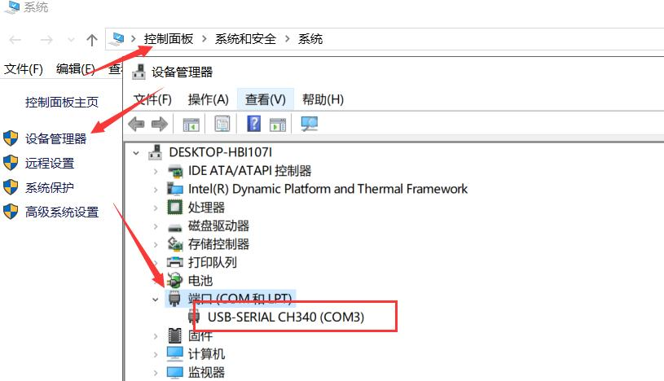

| SMS 系列舵机接法示意图 | SCS/STS 系列舵机接法示意图 |
| :---: | :---: |
| 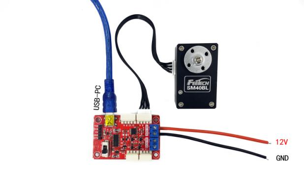 | 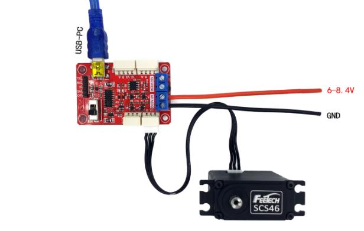 |

**5、打开 FD 软件进行调试：** 选择端口号（设备管理器对应的串口号）→ 波特率（SCS/STS 系列舵机波特率是 1000000，SMS 系列是 115200）→ 打开 → 搜索。

> 端口号不是 CH340 / 波特率设置不对 / 调试板没有接电源 / 电源没电 / 供电电源接错端子口 / 总线上存在相同 ID 号的多个舵机 / 舵机损坏短路 / USB 数据线异常 / 信号板损坏 / 舵机线接触异常等等，都可能导致搜索不到，请逐一排查。

搜到型号后需要点击一下型号，显示成蓝色后数据才能读取正常。

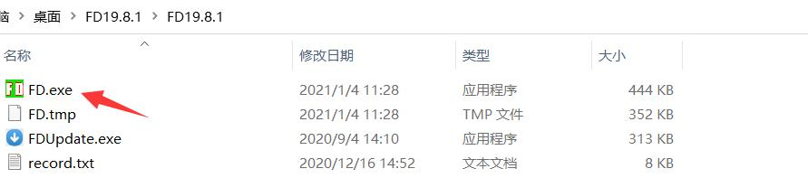

---

## 第 3 页

**6、** 点击舵机型号，在加速度和速度输入数值（SCS 系列没有加速度，只需要输入速度的数值即可），点击设置，拉动滑杆，观察舵机动力轴转动。（有支架的舵机不要装支架调试，可能会夹手或者堵转损坏舵机的风险。）

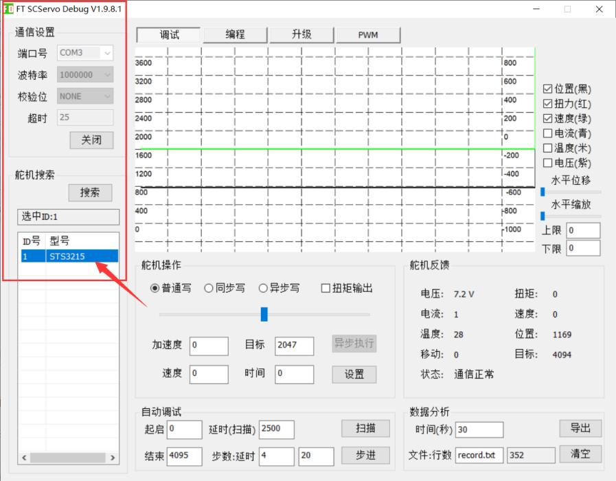

**7、修改舵机 ID：** 点击 ID 一栏，在右下角输入数字，再点击保存即可。（如果要串联几个舵机，需要先接一个舵机按照这个步骤把 ID 改为 1、2、3、4… 再串联，否则一条总线上相同 ID 将无法搜索到型号。）

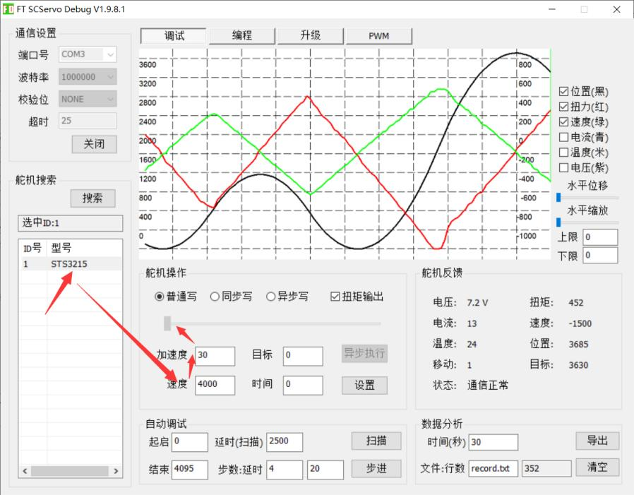

---

## 第 4 页

**8、修改舵机波特率：** 点击波特率一栏，在右下角输入数字，再点击保存即可。

对应比特率：

| 数值 | 波特率 |
| :--: | :-- |
| 0 | 1000000 |
| 1 | 500000 |
| 2 | 250000 |
| 3 | 128000 |
| 4 | 115200 |
| 5 | 76800 |
| 6 | 57600 |
| 7 | 38400 |

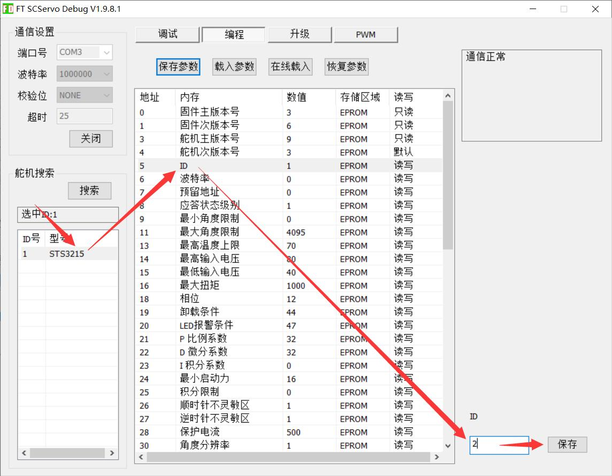

**9、多圈转动**（适用 STS/SMS 系列，SCS 没有这个功能）

- **步骤 1：** 修改地址，9 和 11 的角度限制都设为 0。

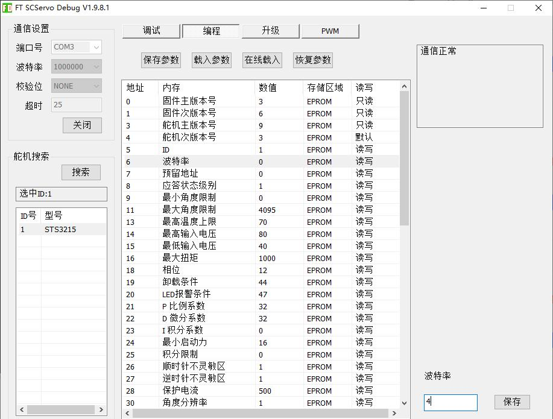

---

## 第 5 页

- **步骤 2：** 在调试界面输入 2 圈的值：`4095 × 2 = 8190`，点击设置即可转 2 圈。

> 注意：圈数掉电不保存，即上电后圈数只显示单圈的绝对值位置；最大可控圈数是 ±7.5 圈。

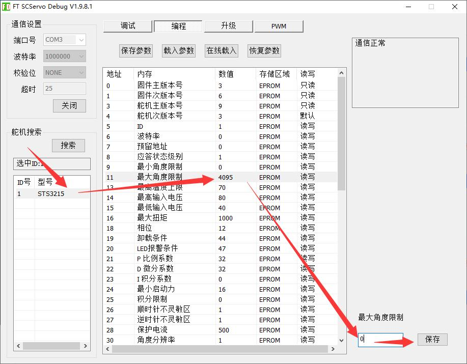

**10、闭环电机模式**（适用 STS/SMS 系列，SCS 没有这个功能）

- **步骤 1、** 运行模式改为 1。

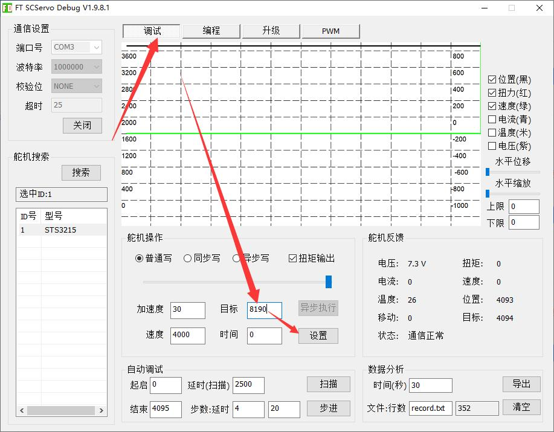

---

## 第 6 页

- **步骤 2、** 速度参数控制，输入 1000 点击设置，顺时针转动；0 停止；-1000 逆时针转。

> 解释：闭环电机模式是随负载增加，速度在一定范围内不减速。

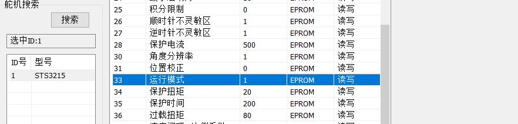

**11、开环电机模式**（适用 STS/SMS 系列，SCS 参考下一个教程 12）

- **步骤 1、** 运行模式改 2。
- **步骤 2、** 时间参数控制，输入 200 点击设置，逆时针转动；0 停止；-200 顺时针转。

> 解释：开环电机模式是随负载增加，速度随负载增加，速度持续减慢。

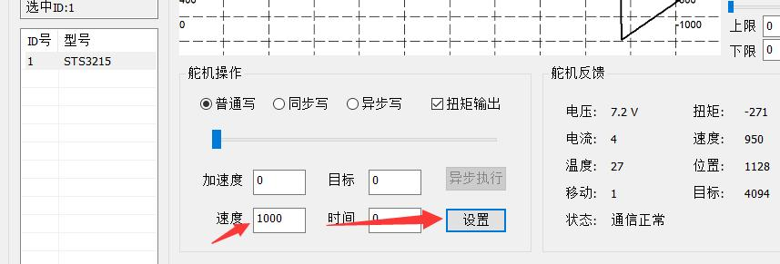

**12、开环电机模式**（适用 SCS 系列）

- **步骤 1、** 修改最大最小角度限制为 0。

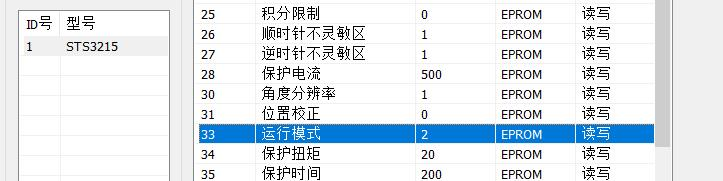

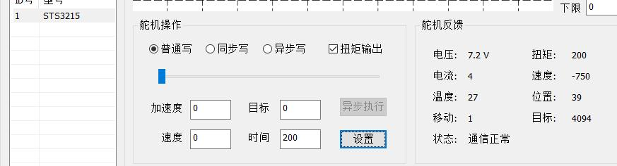

---

## 第 7 页

- **步骤 2、** 时间参数控制，输入 200 点击设置，逆时针转动；0 停止；-200 顺时针转。

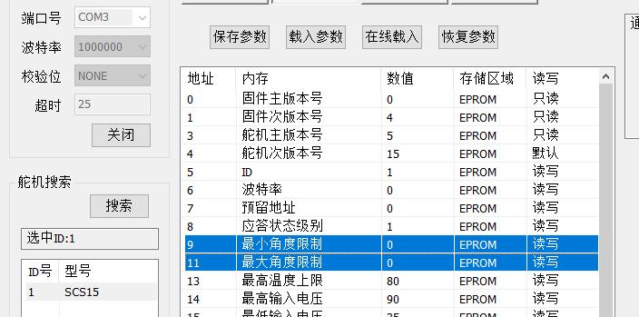

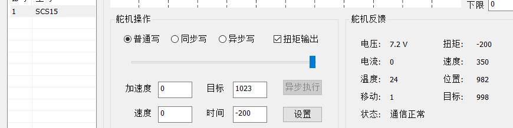

**13、步进模式**（适用 STS/SMS 系列，SCS 没有这个功能）

- **步骤 1、** 角度限制改 0，运行模式改 3。
- **步骤 2、** 目标参数控制，输入任意角度参数，如 1024，点击设置，舵机顺时针转 90 度；再点击设置一次，舵机再次顺时针转 90 度，以此类推，朝一个方向舵机转动，最大角度为 ±7.5 × 4095。

> 解释：步进模式是基于相对位置进行的位置转动，不受角度限制。

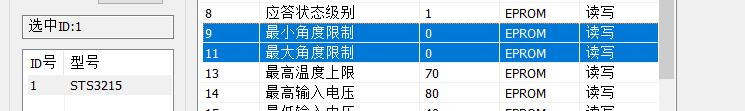

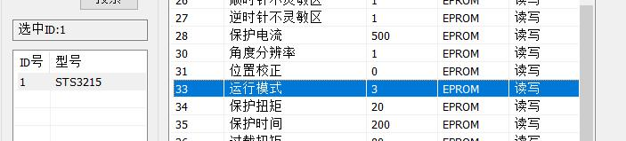

**14、自动调试功能说明**（适用于运行模式为 0 的伺服模式）

自动调试在 FD 软件的调试界面，用于测试舵机反复转动：在"起启"输入起点位置，在"结束"输入终点位置（SCS 系列位置不超 1023，

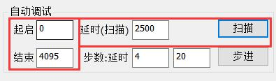

---

## 第 8 页

（续上页）STS/SMS 系列角度不超 4095），在"延时"输入转动的时间，这个时间需大于角度范围的转动时间，否则角度无法达到终点就会返回起点位置。

**15、舵机反馈说明**

舵机反馈：用于反馈舵机当前的状态。

- **电压：** 当前舵机工作电压，单位：0.1V
- **温度：** 当前舵机内部工作温度，单位：°C
- **扭矩：** 当前控制输出驱动电机的电压占空比，单位：0.1%
- **电流：** 最大可测量电流为 `500 × 6.5mA = 3250mA`，单位：6.5mA（部分舵机不具备电流反馈，详见规格书）
- **位置：** 反馈当前所处位置的步数，每步为一个最小分辨角度；绝对位置控制方式，最大值对应最大有效角度。单位：步。
- **目标：** 即目标位置，每步为一个最小分辨角度，绝对位置控制方式，最大对应最大有效角度。单位：步。
- **移动：** 即移动标志，舵机在运动时标志为 1，舵机停止时为 0。
- **状态：** Bit0~Bit5 对应位被置 1 表示相应错误出现（电压 / 传感器 / 温度 / 电流 / 角度 / 过载），对应位 0 为无相应错误。

> 正常显示：通信正常 / 不连接显示：通信超时 / 温度过高显示：过温 / 电压过高过低显示：过压欠压。

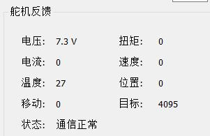

**16、过载过流保护说明**

参考视频：<https://www.bilibili.com/video/BV19Y4y1W7V2/>

**17、在线固件检测和升级**

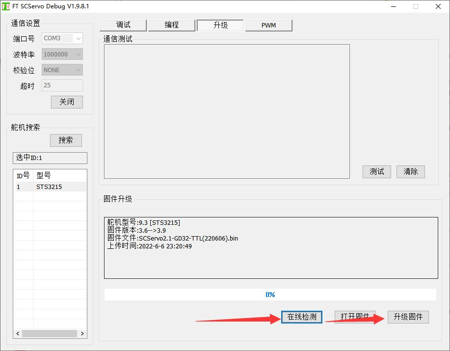

### 最后说明

1. 以上编程中的参数是 FD 软件读取飞特舵机内部的参数。如果您使用的飞特舵机是 SCS 系列，因功能的不同，部分内存表地址将不会显示。
2. 舵机在初次使用时，请按说明和图示进行连接，切勿操之过急。误操作将电源正负接反造成舵机短路或损坏电脑硬件设备，调试不明白之前请不要装上支架或设备上。
3. 电源供电在 12V 以上的舵机，请使用粗一些电源线供电，功率根据负载情况而定，建议选择超过额定电流和电压的功率电池。
4. 如您熟悉以上教程，舵机在您的细心操作中实现转动，恭喜您学会了控制飞特舵机。接下来如果要进入专业模式，通过其他方式如：

---

## 第 9 页

（续上页）Arduino / STM32 / PC / JAVA / C++ / C# 控制。我们已为您准备例程、通讯协议、内存表、串口调试助手等内容，例程请前往 <https://gitee.com/ftservo> 下载对应的例程，供您参考。

### 部分问题解答

**1、如何判定是否开启过载保护？**

查看地址：19 卸载条件的值来判定：

| 位权值 | 32 | 16 | 8 | 4 | 2 | 1 |
| :-- | :--: | :--: | :--: | :--: | :--: | :--: |
| 含义 | 过载 | 空地址 | 电流 | 温度 | 传感 | 电压 |

例如：

- 值为 **32**，表示开启过载保护；
- 值为 **40**（即 32+8），表示开启过载保护和过流保护（目前 SCS 系列无过流检测功能）；
- 值为 **36**（即 32+4），表示开启过载保护和温度保护；
- 值为 **37**（即 32+4+1），表示开启过载保护、温度保护、电压保护；
- 值为 **45**（即 32+8+4+1），表示开启过载保护、电流保护、温度保护、电压保护。

**2、为什么 FD 软件搜不到 ID？**

1. **只串联一个舵机：** 检查硬件连接情况，如果是用 URT-1 板调试，URT-1 的板子需要外接电源，接入的蓝色端子是靠近接舵机的一端，供电电压请参考规格书。
2. **检查波特率：** SCS/STS 系列默认波特率是 1000000bps，SM 系列默认波特率是 115200bps，如果波特率选择不对，就不能搜索出来。
3. **串联多个舵机：** 串联之前需要将每个舵机单独接上 FD 软件，在编程界面修改 ID。如需要串联三个舵机，需要将每个舵机分别修改 ID 为 1、2、3，ID 不同，方能排列搜索出来。另外需要注意的是，如果 SCS 系列和 SM 系列的舵机串联，还需要在编程界面修改波特率至相同，否则 FD 软件只扫描出波特率与舵机波特率相同的舵机出来。

除了以上供电、波特率、ID 等设定好了还是扫不出：

1. 可以尝试换一个舵机，或者换一台电脑试下，因为 URT-1 需要加载驱动，如果驱动没装好也可能无法扫描出来。
2. 检查线路问题，不要使用其他的舵机线，供电电源建议功率选择大的，否则会出现在负载的时候电压频繁波动的问题，导致通信超时等现象发生。
3. 如果第一次操作有扫描出来，但后面再连接时无法扫描出来，需要检查参数是否被修改，或者操作过程中是否正负电源反接导致短路等现象。建议在第一次操作时，连接上后再编程界面中保存一份参数在本地中。

**3、单片机如何控制串口舵机？**

单片机不可以与串口舵机直接连接，需通过信号转换 URT-1 实现控制。也可以通过信号转换电路原理图进行转换，原理图在串口舵机资料包中查看。

**4、URT-1 如何与 STM32 或者 Arduino 连接。**

| URT-1 与 Arduino 连接（示意一） | URT-1 与 Arduino 连接（示意二） |
| :---: | :---: |
| 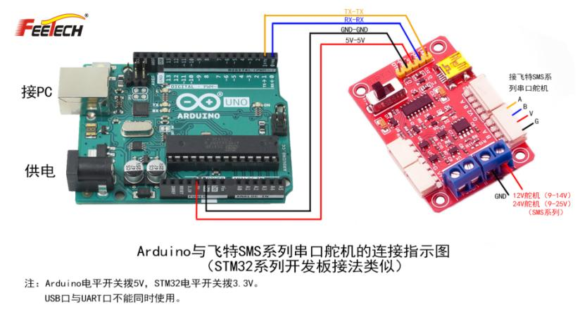 | 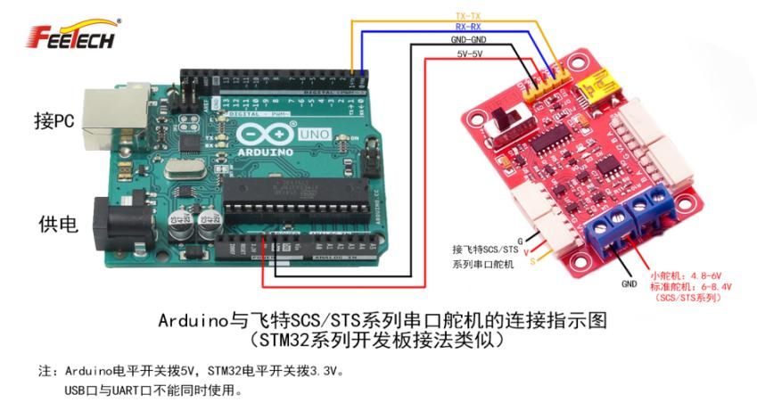 |

**5、舵机如何实现在机械臂夹具中使用。**

仅限夹取相同物品（相同质量的物品），且需提前设定好"扭矩限制"百分比。如果是多次夹取质量体积不固定的物品，无法判定舵机需要输出的扭矩值，可能会损坏物体或舵机出现过载卸力等情况。

以串口舵机为例，串口舵机具备"扭矩限制"百分比输出可控。当物体的重量需要舵机输出 1kg 的力，且能维持物品夹取不掉落又不损伤物体，我们可以通过以下操作实现：假设堵转扭矩为 10kg·cm，在 16 地址"扭矩限制"中输入 100（表示 10kg 的 10% 即 1kg 输出），即可实现 1kg 的力去夹取物品，但同时速度也会变慢。

**6、PDI 参数：** PDI 参数在你的指令变化轨迹如果出现跟随滞后就加大 P 值，如果出现超调就调大 D 值；I 值是在出现静态误差时，为了减小

---

## 第 10 页

（续上页）静态误差才起作用，动态跟随时基本上是 P 在起作用。

**7、协议中：** SCS 系列高字节在前，SMS/STS 低字节在前。

**8、URT-1 板子原理图能不能提供？**

我们只对外提供信号转换电路部分，产品的整个电路原理公司规定不准外发。另外这个信号转换电路已经由上百家公司在使用，可能各个公司自己会再优化下增加 ESD 防护措施。你们如果要用到 485 电平与 TTL 电平舵机复用一个串口，我可以把 TTL 和 485 的转换电路发给您。

**9、每次我让舵机转到 2048，它每次都会偏差 2 个到 8 个分辨率的角度。**

调节 PID 中的 I 参数，从小到大调整，直到偏差减少。但每个舵机的结构造成的齿轮间隙带来的精度误差无法避免。

**10、SM/STS 系列如何将当前位置设定为中位。**

通过 FD 软件设置，打开编程界面，将 40 号地址扭矩开关设置为 128，当前位置即定义为 2048。

**11、SM40BL 如果跟同等扭矩的 SCS40 相比，区别在哪里？**

*结构方面：*

1. SM40BL 采用无刷空心杯电机，相比 SCS40 的有刷空心杯，寿命更长、性能更好等特点。
2. SM40BL 采用全钢齿齿轮组合，相比 SCS40 的钢齿强度更好，中心工艺把控得更高，整体的精度和强度都有很大的提升。
3. SM40BL 采用无接触式的 12 位高精度磁编码器，相比 SCS40 的电位器，在解析精度上更好，线性效果直接颠覆了电位器本身存在的线性问题。直接的表现是电位器可能存在的抖动问题、解析角度不均衡等问题在磁编码上不存在。

*电控方面：*

1. 通信电平的不同，SCS40 是 TTL 通信电平，SM40BL 是 RS485 通信电平，RS485 具有传输更稳定、距离更远、抗干扰能力更强等特点。
2. 功能不同，除了串口舵机本身具备的闭环等特性外，SM40BL 具备加速度启停功能、任意角度安装一键设定中位功能、更高的解析分辨率（4096）、多圈可控等等诸多特点。

**12、舵机的扭力是怎么计算的，堵转扭矩和额定扭矩的区别？**

舵机输出轴是按照公斤每厘米计算的，如 20kg·cm 就是输出轴中心 1CM 处最大负重 20kg；如装上摆臂后，摆臂长度是 10CM，那么摆臂末端所能负重最大是 2kg。舵机在最大负载下寿命极短，需保证在额定负载下，会延长舵机使用寿命。一般堵转的三分之一是额定扭矩，那么上述说的 20kg·cm，额定就是约为 6.5kg 以下，2kg 就是 0.65kg 以下。

**14、舵机抖动怎么办？**

如果是新舵机装配后出现抖动，可以调整以下参数：

1. I 参数 = 0；
2. D 参数调小；
3. 启动扭矩调小；
4. 死区调大。

**15、FD 软件编程界面参数详细说明**

> 内存表（控制表）见 **[STS3215 内存表（详细版 V3.7）](STS_memory_table_detailed_zh.md)** —— 该表涵盖本教程的全部寄存器，并扩展了字节数、取值范围、单位及十六进制指令示例；教程版与 V3.7 固件的默认值差异已在其中标注。

---

*以上内容据飞特官方《使用 URT-1 控制飞特舵机上手教程》（以 STS3215 为例，编辑：章国华，日期：2022/6/17）逐页转换。配图保存于 [`STS3032_tutorial_assets/`](STS3032_tutorial_assets/)。*
