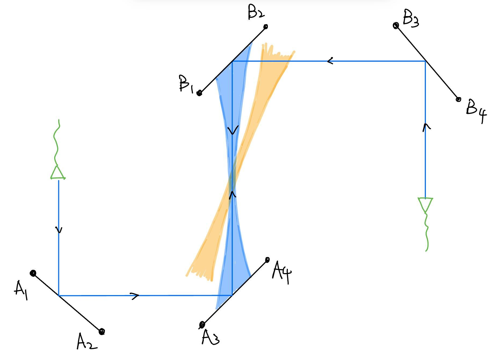
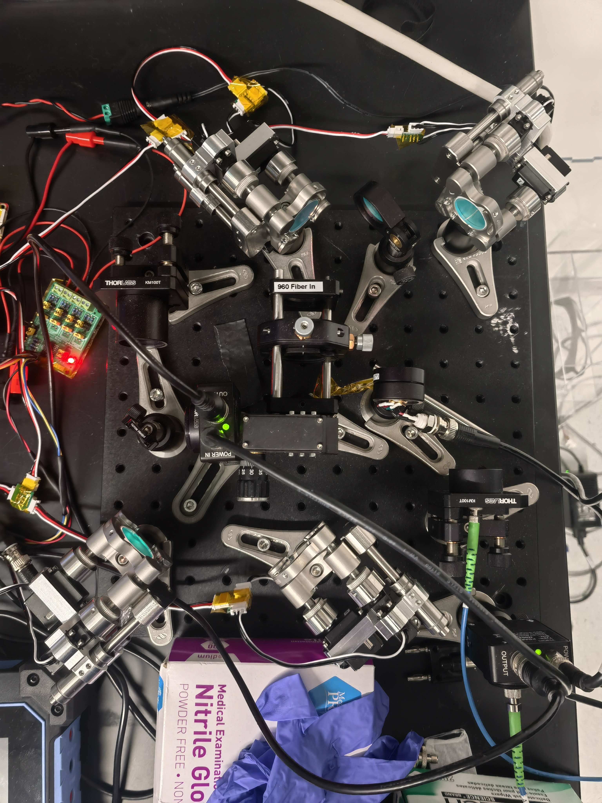
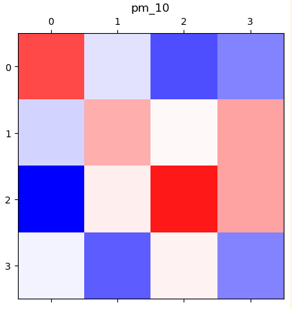
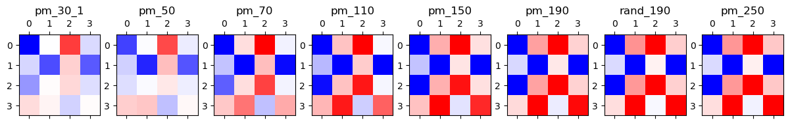
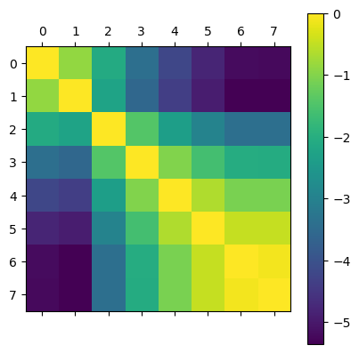
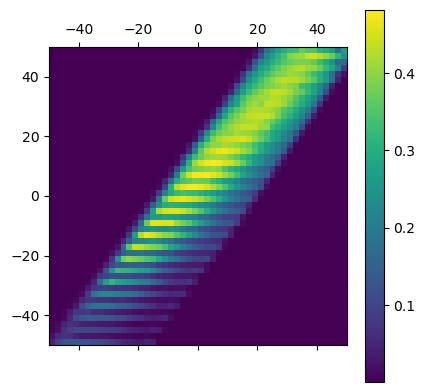
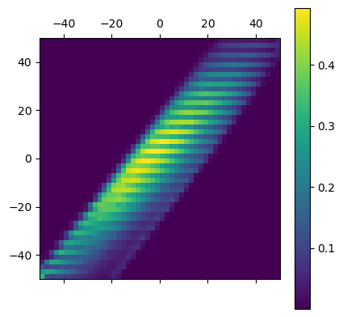
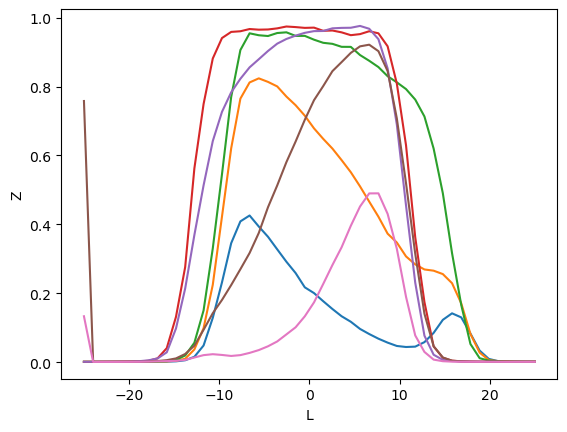
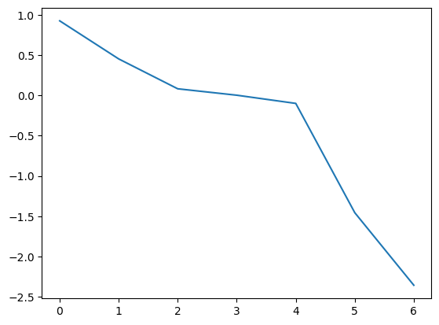

# The Jacobian — Keeping Two Beams Mode-Matched

This note explains **what** the Jacobian means for our mirror mounts, **why** we
calibrate it numerically instead of from geometry, and **how** the calibration
in `servo_aligner/routines/calibrate_jacobian.py` works.

## The setup: forward and backward paths, overlapped

There are **two beam paths** that must stay **mode-matched** (e.g. two
counter-propagating beams overlapping through the cavity / fiber).

Each path is steered by **two mirrors × two knobs = four knobs**:
- Path **A** (upper): knobs `A1, A2, A3, A4`
- Path **B** (lower): knobs `B1, B2, B3, B4`

If we take the plane in the middle and establish a xOy coordinate system, the knobs are arranged such that, to first order, they control:
- The far-away knobs: `A1, A2` mainly control **positions** (`x`, `y`);
- The near knobs: `A3, A4` mainly control **angles** ($\theta_x$, $\theta_y$, here we name them as `x_dot` and `y_dot`);
- The same applies to path B.

To control only positions or angles, we need to change a pair of knobs together in a linear combination (e.g. `A1` and `A3` together to change `x` without changing `theta_x`), that's what we mean by "walking the beam".





## What is the "Jacobian"

Suppose we **move the four knobs of one path** (call them the **master** knobs,
$A$) — for example because we are walking the beam to a new target. To keep the
two beams mode-matched, the **other path's knobs** (the **slave** knobs, $B$)
must move too. The relationship, to first order, is a **4×4 Jacobian matrix**:

$$
J_{ij} \;=\; \frac{\partial B_i}{\partial A_j}
$$

Once $J$ is known, you can drive the master knobs freely and have the slave
knobs **follow automatically** to preserve coupling — no re-optimization needed.

> In code this is exactly what [`compose_para`](../servo_aligner/vectors.py) does: given a
master move `dA` it sets the slave knobs by `dB = J·(dA − offset)`, where `jac_master_mask` selects which channels are the masters. The
[staged spiral/L-BFGS optimization](optimize.md) is what finds the optimal $B$ for each imposed $A$ during calibration.

## Why a numeric ("no-model") Jacobian?

The knob geometry *can* be written analytically (a model-based Jacobian, as
formulated for the ideal mount). We deliberately use the **numeric, no-model**
version instead because:
1. **The geometry of mirrors may be hard to measure**, to get the geometric model, you need to measure the mirror positions in 3d space, and the lever arms from the knobs to the beam, which is not easy to do with high precision.

2. **The knobs are coupled.** In an realistic mirror mount, the mirror's x- and y-tilt are **not** controlled independently by the x and y knobs — there is cross-coupling the simple model ignores.


## How to calibrate the Jacobian (`servo-aligner calibrate-jacobian`)

The core loop turns the physics statement *"for any master setting $A$, find the slave setting $B$ that maximizes coupling"* into data:

1. **Impose a master offset.** Choose an offset vector for the master path's
   knobs. The offset *type* is selectable:
   - `pm`  — push one knob by ±`jacobian.norm` (coordinate directions),
   - `rand` — a random unit direction scaled to `jacobian.norm`,
   - `lin` — a random combination of known coupling directions
     (`jacobian.lin_comb_vectors`),
   - `zero` — no offset (re-optimize in place).
2. **Optimize the slave path.** With the master held at the imposed offset, run the staged [spiral + L-BFGS-B optimization](optimize.md) over the slave knobs to maximize the objective function (for example fiber coupling efficiency). The result yields the optimal slave knob positions for that master offset.
3. **Record the pair.** into the dataset (`jacobian_<type>_<norm>.npy` under
   `jacobian.output_dir`).
4. **Repeat** over many offsets / directions to build up a cloud of
   $(\Delta A, \Delta B)$ pairs, then **least-squares fit** $J$ from
   $\Delta B = J\,\Delta A$ (the fit itself is done in the analysis notebooks).

> Which path is master is just a configuration choice — the roles are symmetric.

A single calibrated 4×4 Jacobian (here from the small `pm_10` offset set) looks
like:




### `compose_para` — where the Jacobian is applied

`compose_para` (`servo_aligner/vectors.py`) builds the full 8-channel angle command:

1. Start from `zero`, add the reduced step `para` on the masked channels
   (`nraddr`).
2. If a Jacobian is supplied, set the slave channels by
   `dB = J·(dA − offset)` (`jac_master_mask` picks the masters,
   `1 − jac_master_mask` the slaves), optionally offset by `jac_x0`.

So the *same* function (a) imposes the master offset during setup and (b) holds
the slaves on the Jacobian during a scan — it is the one place the matrix is
used, both to **calibrate** and later to **apply** `J`.

### One calibration sample

For each sample `i` the routine does (with `jacobian.master: B`):

```python
from servo_aligner.optimize.step import step_optimize

# groups come from the YAML config: layout = cfg.layout()
offset_mask = list(layout.group("B_POS_ALL").mask)   # B is held at the offset; A is optimized
offset = cord_pm_offset(...)                         # or random_norm_offset / lin_comb_offset / zeros

# impose the master offset (and apply an assumed J to the slaves, if any)
zero = compose_para(para=offset, pos_mask=offset_mask, zero=zero,
                    jac=jac_assume, jac_master_mask=offset_mask, jac_x0=jac_x0)

# optimize the slave path on top of that origin (staged: see optimize.md)
zero = step_optimize(measurement, layout.group("A_X_Y"),     zero, opt=cfg.optimize, bounds_single=(-100, 100))
zero = step_optimize(measurement, layout.group("A_X_XDOT"),  zero, opt=cfg.optimize)                  # spiral
zero = step_optimize(measurement, layout.group("A_Y_YDOT"),  zero, opt=cfg.optimize)                  # spiral
zero = step_optimize(measurement, layout.group("A_POS_ALL"), zero, opt=cfg.optimize, method='L-BFGS-B')

_, I = measurement.measure(list(zero), layout.all)   # final intensity
dataset[tuple(offset)].append((list(zero), I))       # record (offset → optimal slaves)
np.save(filename, dataset)
```

`step_optimize` runs one stage via `iterate_points` (spiral / L-BFGS-B / Powell)
and **only commits the new origin if the final intensity stays ≥ 70 % of the best
seen** (`optimize.accept_ratio`) — see [optimize.md](optimize.md).

### Knobs to set before running

In the YAML config (`jacobian:` section of `config/example_config.yaml`):

| Config key | Meaning |
|----------|---------|
| `jacobian.master` | `A` or `B` — which path is held at the offset (the other is optimized). |
| `jacobian.offset_type` | `pm` (coordinate ±), `rand` (random unit), `lin` (combination of known coupling vectors), `zero` (re-optimize in place). |
| `jacobian.norm` | Offset magnitude (the master step size; grow it for [extrapolation](#extrapolation-bootstrapping-from-small-to-large-steps)). |
| `jacobian.n_iterations` | Number of samples to collect. |
| `jacobian.assumed_jacobian` | A previously-fit `J` (`.npz` with `jac` + optional `x0`) to predict slave starts (default `null`). |
| `jacobian.output_dir` | Where `jacobian_<type>_<norm>.npy` — the accumulated dataset — is written; the **matrix fit** `ΔB = J·ΔA` is done afterward in the analysis notebooks. |

## Extrapolation: bootstrapping from small to large steps

A Jacobian fit from **small** master deviations is noisy (the optimizer's
scatter is comparable to the signal). To get an accurate $J$ over a **large**
working range, bootstrap:

1. Run the optimization with **small** offsets; extract a rough $J$.
2. **Increase the step size.** For each larger offset, use the *previous* $J$ to
   **predict the starting slave positions** (`dB = J·dA`), then run the
   optimization from that predicted start. Starting near the optimum keeps the
   slave search short and reliable even at large offsets.
3. Iterate. As the step size grows, $J$ becomes progressively more accurate.



The matrices stabilize as the step size grows; their pairwise similarity
(correlation $-\lVert A-B\rVert^2$) confirms convergence to a consistent $J$:



## Using the calibrated Jacobian

Pass the fitted matrix back into the alignment code via `compose_para`
(`jac=J`, `jac_master_mask=<master channels>`): moving the master knobs then
auto-sets the slave knobs by `dB = J·(dA − offset)`, holding the two beams
mode-matched across the calibrated region. This is the building block for
maintaining mode matching while, e.g., walking the lattice beam onto the cavity
axis or interpolating the MOT trapping position toward the aligned beam.

## Validation: does the calibrated Jacobian hold?

A fitted `J` is only useful if moving the **master** keeps the **slave**
aligned. To test it, impose a master move *along the calibrated coupling
direction* and check the slave's optimum does not drift. The script at the end of
the notes scans the `B_X_XDOT` clip while stepping a Y/Ydot offset that follows
the calibrated coupling and fits the clip center `mu` at each step:

```python
for i in range(-2, 4):
    zero = np.array([0, 0, 0, 0, 0, 100*i, 0, -67*i])   # step along the Y↔Ydot coupling (≈ -0.67)
    scan = raster_2d(measurement.objective(layout.group("B_X_XDOT"), zero=zero),
                     n_pts, scan_range, accept_func=accept_func)   # accept line from clip_scan.accept_lines
    mu = popt_get_mu_cov(fit_gaussian_2d_smooth_heaviside(scan.X, scan.Y, scan.Z))   # extracted clip center
```

**More calibration data ⇒ a flatter region.** A `J` fit from `pm10` data alone
vs from `pm10 + lin_70` — the latter keeps the transmitting band straighter
across the offset range:

| Calibrated `pm10 + lin_70` | Calibrated `pm10` only |
|---|---|
|  |  |

**The clip stays centered over the working range, then breaks.** Overlaying the
row-sum clip profiles across the six offsets, the flat-topped plateaus stay
centered through the middle of the range and only collapse into a skewed
([fat-tail](application.md)) bump at the extreme offsets — the edge of the
calibrated region:



**Quantitatively**, the extracted center `mu` vs offset index is ≈ flat near zero
through the middle (the slave stays aligned → `J` is good) with a sharp drop at
the ends (`J` breaks down outside the calibrated range):



This is the quantitative form of *"with the calibrated Jacobian we maintain good
mode matching within this region"* — and a direct argument for the
[extrapolation](#extrapolation-bootstrapping-from-small-to-large-steps) loop,
which widens the region where `mu` stays flat.

See also [spiral.md](spiral.md) for the 2D search, [optimize.md](optimize.md)
for the staged optimization round run at each calibration point, and
[motor.md](motor.md) for the encoder/de-hysteresis behavior that limits
calibration accuracy.
