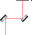
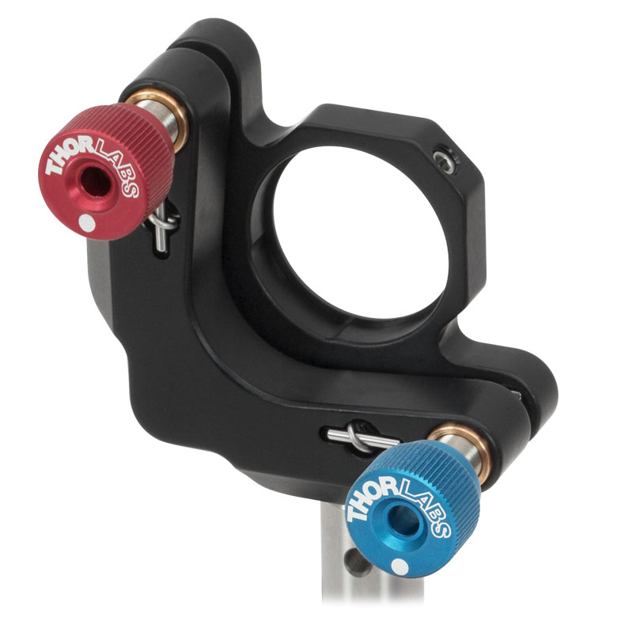

# Mirror Mounts

Background: how we steer a beam with mirror mounts, and the two ways the knobs are coupled — which is really why we have to optimize numerically instead of just turning one knob at a time.

## Two mirrors to control position and angle

A beam hitting a target has four degrees of freedom: where it lands (position `x, y`) and which way it points (tilt `θx, θy`). You need **two mirrors** to control position *and* angle, which is the usual two-mirror "beam walking" setup.

Tilting either mirror shifts the beam's angle *and* moves its position at once. The two mirrors sit at different distances from the target, though, so they mix position and tilt in different proportions. That's the useful part: turn the two knobs in the right combination and the mixes cancel, leaving **pure translation** (beam moves, stays parallel) or **pure tilt** (beam pivots, stays put).
Finding those combinations is what "walking the beam" means, and it's why the optimizer always works the knobs in coupled pairs rather than one at a time.

In the code these four knobs per path are the `x, y, xdot, ydot` channels; a "position" (`x` and `y`) knob does not mean it only moves the beam's position, but that it is farther away along the beam path and therefore has more leverage on position than angle. The same applies to the "angle" (`xdot` and `ydot`) knobs.

## In reality: the mount itself isn't orthogonal

A kinematic mirror mount (the standard Thorlabs KM100 / Polaris kind) sets tilt with three contact points: one fixed pivot and two adjuster screws, one for `x`-tilt and one for `y`-tilt. Near the centered position (when the three setscrew are with equal length), the two screws act on perpendicular axes, so they're independent — turn the `y` screw and only `y`-tilt changes.

That only holds near center. Once a knob has been run far — say a large `x`-tilt — the whole mirror plate is cocked over, and the `y` screw's rotation axis tilts along with it. Now turning the `y` knob doesn't just change `y`-tilt; it leaks into `x`-tilt too. So the further you get from center, the more the two axes bleed into each other.

## Why it matters here

Both effects mean you can't align by eye-balling one knob at a time, and the second one means there's no clean geometric formula to lean on far from center. That's the whole reason we measure the coupling instead of modeling it — the numeric [Jacobian](jacobian.md) and the [spiral search](spiral.md) over coupled knob pairs. In practice it pays to keep the mounts near their centered range; a knob that has drifted far is exactly where coupling #2 bites, and a stubborn [fat tail in a clip scan](application.md) is usually the sign you've wandered off-center.
