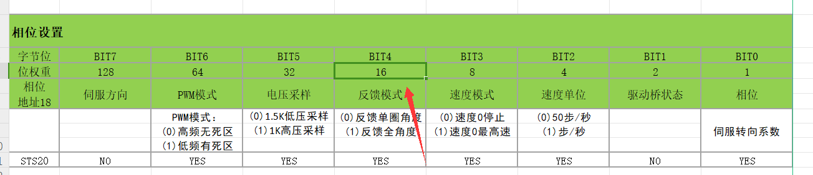

# STS3032 Servo — Register & Position Setup

We use FEETECH **STS3032** serial-bus servos used to turn the
mirror-mount knobs.

## Connection

```
Raspberry Pi  →  URT / serial driver board  →  servo 1 → servo 2 → … (daisy chain)
```

Servos share one serial bus and are addressed by **ID** (not by position on the
chain). The Pi-side mapping of *channel index → [servo ID, name]* lives in
`customize.py` (`sts3032_dict`).

Default bus settings: **baudrate 1 000 000**,

## Encoder & angle convention

The magnetic encoder reports an integer position. A single turn spans
**0 – 4095**, with **2048 = center (0°)**:

```
angle_deg = (position - 2048) * 360 / 4096      # position_to_angle
position  = angle_deg * 4096 / 360 + 2048        # angle_to_position / a2p
```

So one encoder step ≈ 0.088°, and one full knob turn = 4096 steps.

### Multi-


A knob often needs **more than one turn**. There are two ways to track it:

1. **Software turn counting** (default fallback) — `Servoset` watches for large
   jumps in the raw 0–4095 reading (a wrap from ~4095→0 or back) and increments
   an internal `turn_num`, so `angle_current = raw + 4096 * turn_num`. See
   `sts3032.set_position` in `src/servodriver.py`.
2. **Hardware multi-turn reporting** — set **Register 18** as below; the servo
   then reports the full multi-turn angle directly. This is more robust and is
   the recommended setup.

> ⚠️ Either way, **a power loss on the driver board resets the turn count.**
> After a power cycle, re-zero / re-home before trusting absolute angles.

## Register 18 — Phase setting (enable multi-turn)

Register 18 (相位设置, "phase setting") is a bit-field. The bit we care about is
**BIT4 (weight 16) — feedback mode**:

- `0` → report **single-turn angle only** (−180°…+180°)
- `1` → report **full multi-turn angle**



The factory default for this register is **108** (`0b0110_1100`). Setting BIT4
turns it into **124** (`0b0111_1100`):

```
108  =  0b0110_1100   (single-turn feedback)
124  =  0b0111_1100   (multi-turn feedback)   ← 108 + 16
```

With **124** the servo reports roughly **−180° … +2700°** (≈ ±7.5 turns).

**How to change it:** connect the servo with FEETECH's **FD** debugging tool
(`FD1.9.8.2`, in the Notion export under `tmp/`), open the Register-18 view,
change the displayed value from 108 to 124, and write it to the servo.

## Min / Max position registers

Set the **min and max position limits to `0, 0`** (not `0, 4095`):

- With `0, 4095` the servo **cannot travel below −180°**.
- With `0, 0` travel below −180° is allowed; in this mode going to **−180° is
  equivalent to going to +2700°** (the limits are effectively disabled and the
  multi-turn range is used).

## Control-table registers used by the driver

`src/servodriver.py` reads/writes these addresses (STS control table):

| Addr | Name | Used for |
|-----:|------|----------|
| 40 | `TORQUE_ENABLE`    | `1` enable, `0` disable torque. Writing **`128`** triggers the **set-zero / mid-point calibration** (`set_zero`). |
| 41 | `GOAL_ACC`         | Goal acceleration (`SERVO_ACC` from `customize.py`). |
| 42 | `GOAL_POSITION`    | Target position (written via group-sync-write for all servos at once). |
| 46 | `GOAL_SPEED`       | Goal speed (`SERVO_SPEED` from `customize.py`). |
| 56 | `PRESENT_POSITION` | Current position (group-sync-read; basis for turn counting). |
| 66 | `MOVING_STATUS`    | `0` when the servo has stopped — used to know a move finished. |

Speed/acceleration defaults come from `customize.py` (`SERVO_SPEED`,
`SERVO_ACC`); per-servo overrides are possible via `set_speed` / `set_acc`.

## De-hysteresis (backlash compensation)

The **3D-printed** mirror-mount frame is **not perfectly rigid**, and the coupling between the frame and the mount has play. The result is **mechanical hysteresis (backlash)**: the actual knob angle for a given encoder position depends on *which direction you last approached from*. Two consequences:

- Commanding the same encoder position from above vs from below lands the knob at slightly different physical angles.
- A Jacobian calibrated over a **small** angular range comes out inaccurate, because the backlash deadband is comparable to the calibration steps (see [jacobian.md](jacobian.md)). This also interacts with the servo's own forward/backward asymmetry — at default PID it tracks cleanly in the **+** direction but can **oscillate** going **−**.

### The fix: always approach from the same side

`Servoset.set_position` (`src/servodriver.py`) makes every final approach come
from the **+** direction, so backlash is always taken up the same way. For each
servo it compares the goal to the current position:

- **Moving `+` (or by ≤ `POS_THRESHOLD = 2` encoder steps):** go straight to the
  goal.
- **Moving `−` by more than `POS_THRESHOLD`:** first **overshoot to
  `goal − 100`** encoder steps, then move **up** to the goal — so the knob always
  settles while turning in the `+` direction.


### Toggling it

- `servos.de_hysterisis` — `True` by default (set in `Servoset.__init__`).
- CLI: the `dehys 0|1` subcommand (`STSServer.set_dehys_args`).
- It is a **speed/accuracy trade-off**: each negative move becomes *two* physical
  moves. `calibrate_jacobian.py` runs with it **on** (accuracy matters);
  `clip_scan.py` runs with it **off** (a long raster scan where speed wins).
  Turn it on whenever calibration accuracy matters.

