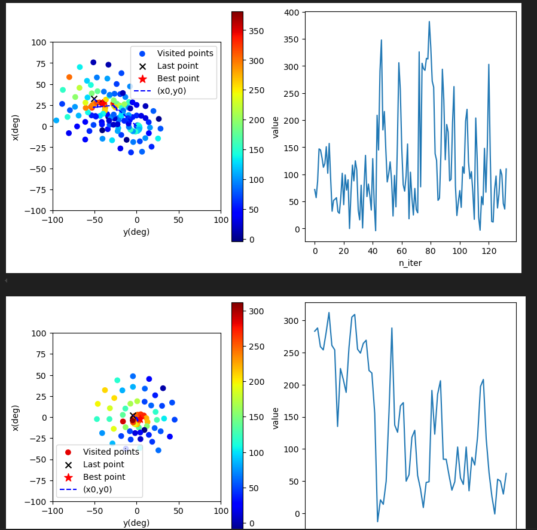
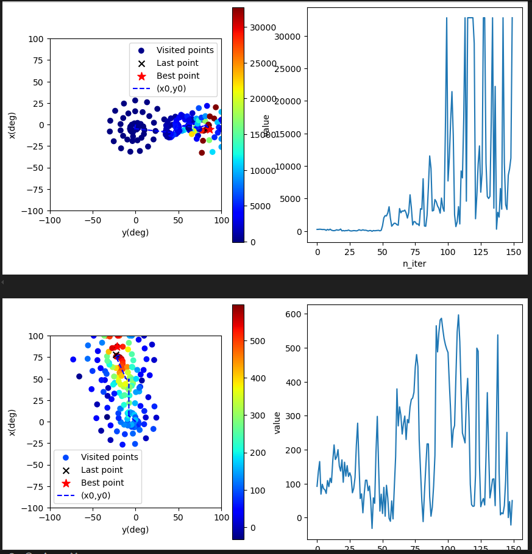
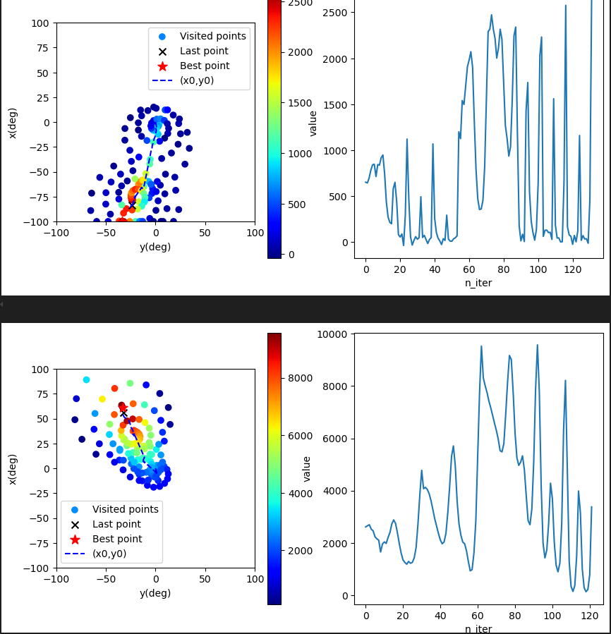
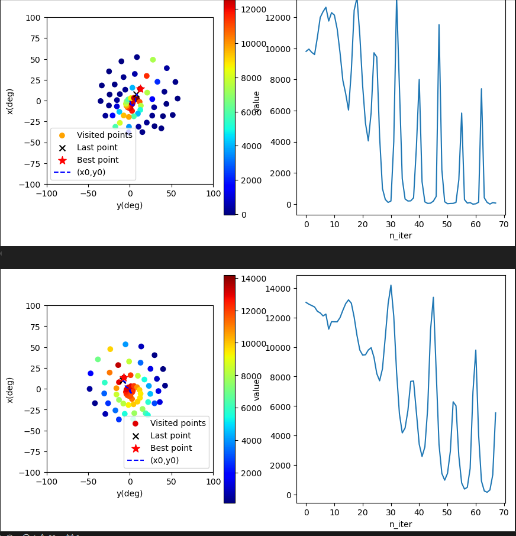

# One Optimization Round — Iterating Between Knob Pairs

[spiral.md](spiral.md) describes the 2D **spiral descent** search used on a
single pair of knobs. This note describes how those 2D searches are **staged
into a full optimization round** over one beam path's four knobs
(`x, y, xdot, ydot`): first spiral passes in well-chosen 2D subspaces, then one
full **4D L-BFGS-B** polish at the end. These are ingredients **C** (iterate
between pairs of knobs) and **D** (finish with a gradient step) from the
developer notes; the staging is implemented in
[`calibrate_jacobian.py`](../src/calibrate_jacobian.py) via
[`step_optimize`](../src/step_optimize.py).

## Why 2D pairs instead of all four knobs at once?

- **The spiral is 2D-only.** `pts_iterator` asserts `N_var == 2` for
  `method="spiral"` — a space-filling spiral has no useful high-dimensional
  analogue: the number of samples (= motor travel) needed to "fill" the space
  explodes with dimension.
- **The knobs are coupled in known pairs.** Horizontally, the position knob `x`
  and the angle knob `xdot` steer the same beam coordinate, so they form a
  tilted, elongated ridge — exactly the landscape the spiral handles well; the
  same holds for `y` / `ydot` vertically (see [jacobian.md](jacobian.md)). The
  horizontal and vertical subspaces, by contrast, are nearly independent of
  each other, so little is lost by optimizing them separately.

## Iterating between knob pairs

Because the two knobs of a pair are coupled, optimizing one pair shifts the
optimum of the other. So we **alternate** `X_XDOT` ↔ `Y_YDOT` (ingredient C) and
watch the cloud tighten around the peak over successive passes:

| 1st pass | 2nd pass |
|---|---|
|  |  |
| **3rd pass** | **4th pass** |
|  |  |

Left panel: visited points colored by intensity, with the dragged `(x0, y0)`
center trajectory; right panel: intensity vs iteration. Across passes the
visited cloud contracts toward the bright region.

## The staged round in code (`calibrate_jacobian.py`)

One full round chains four `step_optimize` stages, threading the running
origin `zero` (a full 8-channel angle vector) from each stage into the next:

```python
# 1. coarse centering: spiral on the two position knobs, wide bounds
zero = step_optimize(servos, callback_func, pos_mask=A_X_Y_MASK,    zero=zero, bounds_single=(-100, 100))
# 2.–3. spiral in each coupled 2D subspace
zero = step_optimize(servos, callback_func, pos_mask=A_X_XDOT_MASK, zero=zero)
zero = step_optimize(servos, callback_func, pos_mask=A_Y_YDOT_MASK, zero=zero)
# 4. full 4D gradient finish over all four knobs of the path
zero = step_optimize(servos, callback_func, pos_mask=A_POS_ALL_MASK, zero=zero, method='L-BFGS-B')
```

1. **Coarse centering (spiral on `X_Y`).** Search the two *position* knobs
   alone over wide bounds (±100°) to find the signal at all. With only
   position moving, the landscape is a simple (if broad) peak.
2. **Spiral on the horizontal pair (`X_XDOT`).** Walk the coupled
   position-angle ridge in the horizontal plane.
3. **Spiral on the vertical pair (`Y_YDOT`).** Same for the vertical plane.
   (Stages 2–3 can be repeated to alternate between the pairs, as shown
   above; one pass of each is usually enough once the centering stage has
   done its job.)
4. **4D polish (`POS_ALL`, L-BFGS-B).** Once the spirals have found the basin,
   a short gradient search over all four knobs simultaneously (ingredient D;
   `BFGS_params`: `maxiter=10`, `eps=5`) tightens the optimum across the
   pair-to-pair coupling the 2D stages can't see.

During [Jacobian calibration](jacobian.md) the masks actually select the
**slave** path (the `B_*` masks when `MASTER == "A"` and vice versa): the
master path is held at an imposed offset while the slave path is re-optimized,
and the resulting `zero` is recorded as one `(offset → optimal slaves)`
calibration point.

## How a stage commits (`step_optimize`)

Each stage optimizes a *reduced* parameter vector — only the knobs selected by
its `pos_mask` — on top of the current `zero`; `callback_func` composes the
full angle command, moves the servos, and reads the photodiode (see
[spiral.md](spiral.md)). After the search, the stage re-measures at the
proposed optimum and **only commits the new origin if that intensity stays
≥ 70 % of the best seen during the stage** (`Inow/Ibst > 0.7`) — a guard
against ending a noisy search on a bad point. On commit, the reduced result is
added into the full 8-vector (`nraddr`); otherwise `zero` passes through
unchanged.

`pts_iterator` dispatches each stage to `"spiral"` (default, tuned via
`spiral_params` in `step_optimize.py`), `"L-BFGS-B"`, or `"Powell"`, and
records/plots every `(para, intensity)` sample.

See also [spiral.md](spiral.md) for the 2D search itself, and
[jacobian.md](jacobian.md) for how rounds are repeated over many master
offsets to fit the coupling Jacobian.
