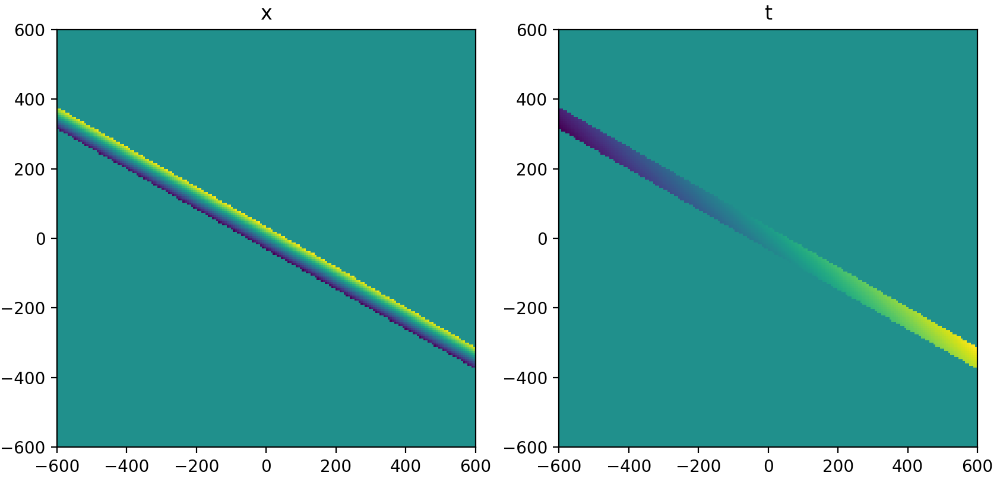
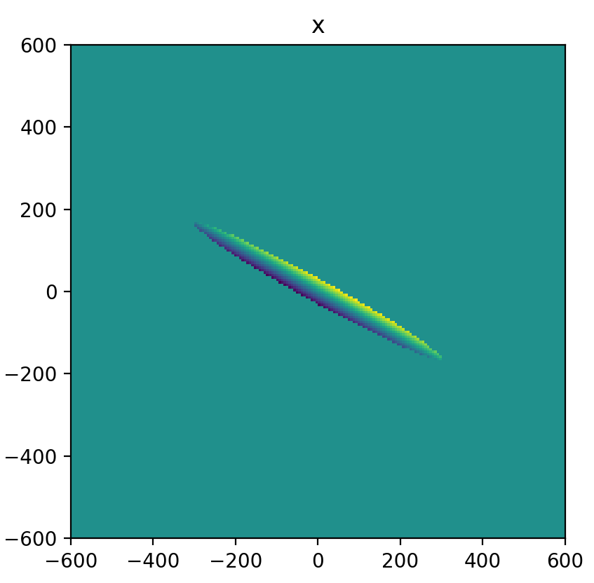
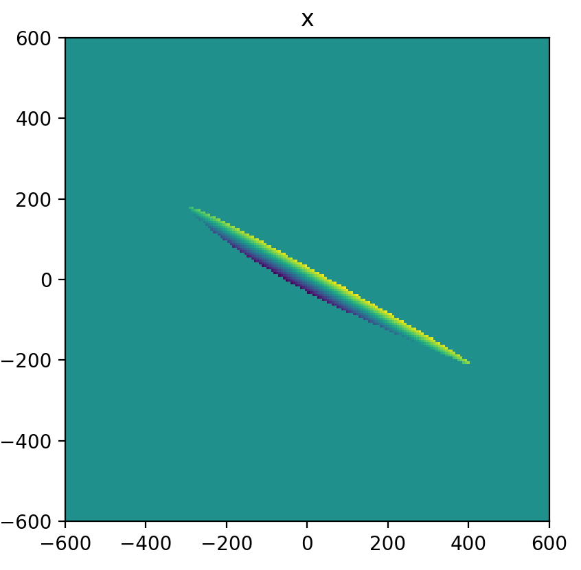
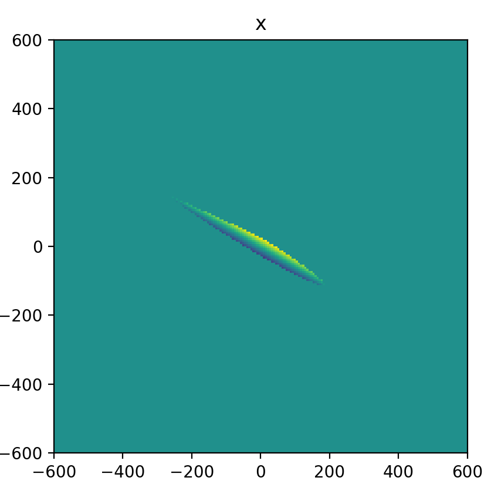

# Numerical Simulation

Two hardware-free simulations support the design and let you run things off the
Pi:

1. **A geometric clipping model** (`numeric_sim.py`) — predicts the shape of the
   transmitting "clip" region under different XY-coupling assumptions, and
   explains the [fat-tail](application.md) distortion and when the
   iterate-between-pairs alignment converges.
2. **An optimizer test bed** (`spiral.py` `__main__`) — runs the
   [spiral descent](spiral.md) against a synthetic 2D objective so the algorithm
   can be developed without motors.

Both are pure NumPy/Matplotlib and safe to import/run anywhere.

## 1. The geometric clipping model (`numeric_sim.py`)

### What it models

A ray is steered by two mirrors and must pass a **cavity bore of diameter `d`**
sampled at the front and back of a length `L`. Transmission is `1` only while
**both** sample points are inside the bore. In pseudocode (developer notes):

```
x       = -L1·tan(2·t1) + L2·tan(2·(t1+t2))      # transverse position at the bore
t       =  2·(t1+t2)                              # total ray angle
x_front =  x - (L/2)·tan(t)
x_back  =  x + (L/2)·tan(t)
transmission = W(|x_front| < d/2) · W(|x_back| < d/2)
```

where `t1, t2` are the two mirror tilts and `W` is a top-hat window. The actual
implementation (`calc_data`, `f`, `g`, `theta`) does this in 2D — it windows
`sqrt(x₁²+y₁²)` and `sqrt(x₂²+y₂²)` against the circular bore — and converts knob
angle → mirror tilt with `t_mirror`. Geometry constants at the top of the file:
`L = 16 mm`, `d = 1.4 mm`, `L1 = 0.2 m`, `L2 = 0.2·2.35 m`.

### XY coupling = the crosstalk matrix

The whole point is the **coupling** between the x- and y-knobs. It enters as a
`crosstalk_matrix` that maps the scanned tilt vector into the orthogonal axis
before computing transmission. Two forms are provided:

```python
# constant, centered coupling
crosstalk_matrix     = lambda t1, t2: np.array([[0.1, 0  ],
                                                 [0,   0.3]])
# angle-dependent ("rotating") coupling — the off-diagonal grows with the knob
crosstalk_matrix_rot = lambda t1, t2: np.array([[0.1 + t1/6,  0       ],
                                                 [0,           0.3 + t1/10]])
```

`calc_data(crosstalk_matrix, zero, scan_type="xxdot"|"yydot")` rasters a knob
pair and returns the transmission map `Z` (plus intensity-weighted `x` and `t`
maps for diagnostics).

### What it shows

Sweeping the coupling assumption reproduces the experimentally observed clip
shapes:

| No coupling | Constant coupling (centered) |
|---|---|
|  |  |

| Angle-dependent coupling | Coupling, off-center |
|---|---|
|  |  |

**Conclusions (from the notes):**

1. **Long axis ≈ angle `θ`, short axis ≈ position `x`.** Moving along the short
   axis is mainly `x`; moving along the long axis is *not quite* pure `θ`.
2. **XY coupling shrinks** the transmitting ellipse.
3. **Off-center coupling _and_ angle-dependent coupling both distort** the
   ellipse — this is the [fat tail](application.md). A symmetric ellipse means
   you are near the coupling center; a fat tail means you are off it.

### Convergence of the iterate-between-pairs alignment

Driving the simulated model with the old x–y iteration algorithm shows **when it
converges**:

- ✅ Converges under **no coupling** and **constant coupling** (step size and
  `|zero|` both decay to zero).
- ❌ Does **not** converge under **angle-dependent coupling** — *"we are chasing
  the minimum, but the minimum keeps being dragged in the wrong direction."*

This is the concrete justification for the [spiral descent + Jacobian](spiral.md)
approach: a fixed iterate-between-pairs scheme is provably unstable once the
coupling rotates with knob angle, so the optimum must be tracked
([spiral](spiral.md)) and the cross-coupling measured ([Jacobian](jacobian.md))
rather than assumed constant.

> The model lives at module top level (`numeric_sim.py` runs `calc_data` on
> import and calls `plt.show()`); adjust `crosstalk_matrix`, `zero`, and
> `scan_type` there to explore. `example/notebooks/numeric_sim.ipynb` is the
> interactive version.

## 2. Optimizer test bed (`spiral.py`)

`spiral.py`'s `__main__` block builds a tilted 2D Gaussian
(`gaussian2d` / `covariance_matrix`) and runs `SpiralPath.maximize` against it,
plotting the space-filling spiral path and the dragged `(x0, y0)` center. This is
how the [spiral-descent](spiral.md) parameters (`SPIRAL_RESOLUTION`, `D`,
`alpha`, `COEF_I_RESET_ORIGIN`, …) are tuned without touching hardware:

```bash
python spiral.py        # from src/ — no servos needed
```

The shared fitting helpers it exercises (`gaussian_2d`,
`gaussian_2d_smooth_heaviside`, `fit_gaussian_2d*`, `statistics_skewness`) live in
`fit_gaussian.py` and are the same ones used to fit real
[clip scans](application.md), so a fit validated in simulation behaves the same
on measured data.

See also [spiral.md](spiral.md) (the algorithm), [application.md](application.md)
(the fat tail on real data), and [jacobian.md](jacobian.md) (measuring the
coupling the model here only assumes).
