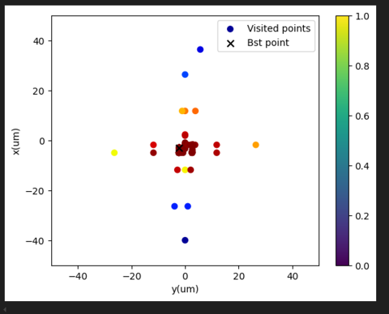
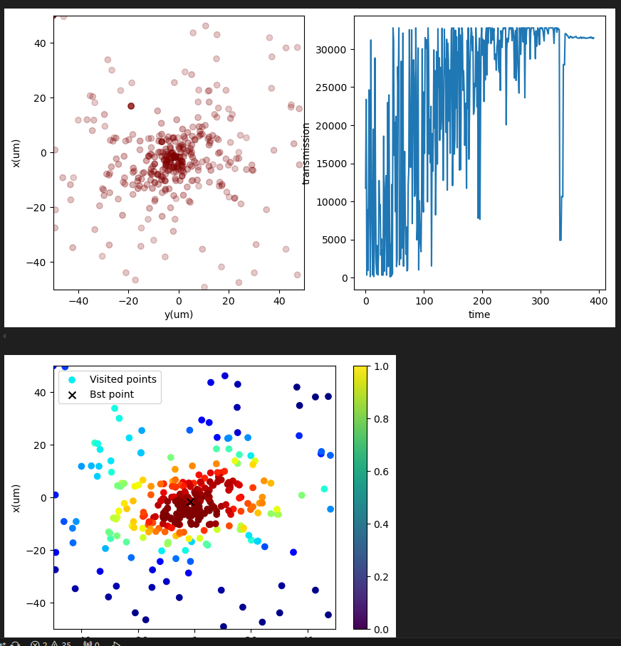
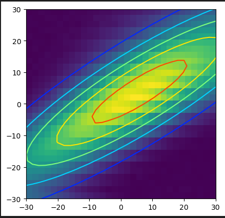

# Spiral Descent — Optimizing Fiber Coupling

This note explains **why** we use a custom "spiral descent" search to maximize
fiber coupling (and beam alignment generally), and **how** it is implemented in
`src/spiral.py` / `src/pts_iterator.py` / `src/step_optimize.py`.

## The optimization problem

We turn a pair of mirror knobs and read a **photodiode intensity** (fiber
coupling, MCP3424 ADC) as the objective to maximize. This objective is awkward
for off-the-shelf optimizers:

- **Each evaluation is slow and expensive.** A single sample means physically
  moving servos (plus the de-hysteresis overshoot-and-return), waiting for them
  to stop, then reading the ADC. Motor travel time dominates the run.
- **It is noisy.** We read the photodiode twice and average, but the signal
  still fluctuates.
- **Knobs are coupled.** On each mirror the "position" and "angle" knobs are not
  independent (see [jacobian.md](jacobian.md)), so the landscape is a tilted,
  elongated ridge rather than a clean bowl.

Because every sample costs motor travel, the cost we actually care about is
**total distance moved**, not just the number of function evaluations.

## Why not a standard optimizer?

We compared the usual candidates on the real coupling landscape:

| Method | Behavior | Problem |
|--------|----------|---------|
| **Powell** | Coordinate-style line searches (the cross pattern below) | Gets stuck along the coupled ridge; many long traverses. |
| **Differential evolution** | Random population scattered over the whole box | Huge total motor travel — it jumps all over the plane. |
| **Gaussian fit** | Raster/sample then fit a 2D Gaussian to find the peak | Wastes travel on a full grid; the fit is biased when the spot is distorted ("fat tail"). |





The common failure is **wasted motor travel**: random or grid sampling ignores
that adjacent-in-time samples should be adjacent-in-space to keep moves short.

## The spiral descent idea

The algorithm has four ingredients (labels from the developer notes):

- **A — space-filling spiral.** Sample along an Archimedean spiral that
  gradually fills the 2D plane. Consecutive points are *close together*, so
  total motor travel is minimized while still covering the area.
- **B — drag the center toward higher intensity.** The spiral's center
  `(x0, y0)` is continuously pulled in the direction of the intensity-weighted
  centroid of recent samples — a noise-robust, gradient-like update. The search
  "flows uphill" while it scans.
- **C — iterate between pairs of knobs.** Instead of one high-dimensional
  optimization, optimize one 2D knob-pair at a time (e.g. `X_XDOT`, then
  `Y_YDOT`) and repeat. This keeps every spiral 2D and sidesteps the curse of
  dimensionality.
- **D — finish with a gradient step.** Once the spiral has found the basin, run
  **L-BFGS-B** over all knobs for the final tightening.

## How the spiral works (`SpiralPath` in `spiral.py`)

Per step (`step_rdxy` → sample → `step_x0y0`):

1. **Grow the radius.** `r = d · (θ − θ_axis)`, with `θ` advancing by
   `Δθ = 2π / SPIRAL_RESOLUTION` each step (so `SPIRAL_RESOLUTION` points per
   loop). This is an Archimedean spiral; `d` sets the spacing between successive
   arms.
2. **Sample.** `(x, y) = (x0 + r·cosθ, y0 + r·sinθ)`, clamped to `bounds`; call
   the objective to get intensity `I`.
3. **Adapt the arm spacing `d`.** If the recent mean intensity is low (we're far
   from the peak) `d` grows so the spiral spreads out faster; near the peak `d`
   stays tight. (`uds = arctan(1 − mean_I / I_meaningful)`.)
4. **Drag the center** (`step_x0y0`). Over the last `SPIRAL_RESOLUTION` points
   compute the intensity-weighted mean displacement `(mean_dx, mean_dy)` from
   `(x0, y0)`, clamp it to `MAX_X0Y0_DISPLACEMENT`, and step the center by
   `alpha · mean_d`. `alpha` is scaled up when the recent samples are bright and
   anisotropic (`ellipticity = std_I / mean_I`), so the center moves decisively
   only when there is a real gradient to follow.
5. **Reset the origin on a breakthrough.** If a fresh sample beats the running
   best by `COEF_I_RESET_ORIGIN`, jump `(x0, y0)` to that point and restart the
   spiral there (`I_max` decays by `COEF_I_DECAY` so the bar isn't permanent).

The search stops after `SPIRAL_RESOLUTION · SPIRAL_SPAN` iterations. The spiral
is **2D only** — `pts_iterator` asserts `N_var == 2` for `method="spiral"`.

Tuned parameters live in `step_optimize.py` (`spiral_params`): `I_meaningful`,
`D`, `SPIRAL_RESOLUTION`, `SPIRAL_SPAN`, `COEF_I_RESET_ORIGIN`, `alpha`, …

## Iterating between knob pairs

Because the two knobs of a mirror are coupled, optimizing one pair shifts the
optimum of the other. So we **alternate** `X_XDOT` ↔ `Y_YDOT` (ingredient C) and
watch the cloud tighten around the peak over successive passes:

| 1st pass | 2nd pass | 3rd pass | 4th pass |
|---|---|---|---|
|  |  |  |  |

Left panel: visited points colored by intensity, with the dragged `(x0, y0)`
center trajectory; right panel: intensity vs iteration. Across passes the
visited cloud contracts toward the bright region.

## Where it all plugs together

- **`spiral.py` — `SpiralPath`**: the spiral-descent algorithm itself
  (`maximize(function, x0, bounds, options)`). Has a hardware-free matplotlib
  demo under `__main__` (maximizes a tilted 2D Gaussian) — the only way to see
  the algorithm run off the Pi.
- **`pts_iterator.py` — `pts_iterator`**: dispatches to `"spiral"`,
  `"L-BFGS-B"`, or `"Powell"`, records every `(para, intensity)` sample, and
  plots the trace + convergence curve.
- **`step_optimize.py` — `step_optimize`**: runs one optimization stage on a
  given `pos_mask`, then **only commits the new origin if the final intensity
  stays ≥ 70 % of the best seen** (guards against ending on a bad/noisy point).

A full alignment stage (see `calibrate_jacobian.py`) chains these as:

```python
zero = step_optimize(..., pos_mask=A_X_Y_MASK,    bounds_single=(-100,100))  # coarse centering
zero = step_optimize(..., pos_mask=A_X_XDOT_MASK)                            # spiral on X / Xdot
zero = step_optimize(..., pos_mask=A_Y_YDOT_MASK)                            # spiral on Y / Ydot
zero = step_optimize(..., pos_mask=A_POS_ALL_MASK, method='L-BFGS-B')        # final gradient step
```

That is ingredients **C** (iterate knob pairs) followed by **D** (gradient
finish). The resulting `zero` (the optimized knob origin) is what the
[Jacobian calibration](jacobian.md) collects across many imposed offsets.
