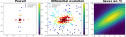

# Spiral Descent — Optimizing Fiber Coupling

This note explains **why** we use a custom "spiral descent" search to maximize fiber coupling (and beam alignment generally), and **how** it is implemented in [`src/spiral.py`](../src/spiral.py) / [`src/step_optimize.py`](../src/step_optimize.py) (which holds both `pts_iterator` and `step_optimize`). How spiral stages are chained into a full optimization round is described in [optimize.md](optimize.md).

## The optimization problem

We turn a pair of mirror knobs and read a maximize an objective (here the objective is the fiber coupling, which is measured by a photodiode and sampled with an MCP3424 ADC).
## Why not a standard optimizer?
This optimization problem is awkward for off-the-shelf optimizers:

**For gradient-based methods:** The objective is noisy and the knobs are coupled, making it difficult to estimate gradients accurately.

**For stochastic methods:**  We examine the behavior of several optimizer with experimental data from a real fiber-coupling optimization run.

| Method | Behavior | Problem |
|--------|----------|---------|
| **Powell** | Coordinate-style line searches |  Gets stuck along the coupled ridge |
| **Differential evolution** | Random population scattered over the whole box | Huge total motor travel; waisting time. |
| **Gaussian fit** | Raster 2D then fit a 2D Gaussian to find the peak | Wastes travel on a full grid |

The common failure is **wasted motor travel**: The list of samples is usually scattered across the knob space. Unlike in computer science where function evaluations are cheap, here each sample requires moving the motors physically and waiting for them to stop. The motor travel time dominates the run, so random sampling is inefficient. Also, the sample points which are close together in space are often far apart in time, which adds slowly-drifting noise to the objective.

## The spiral descent idea

- **A — space-filling spiral.** Sample along an Archimedean spiral that gradually fills the 2D plane. Consecutive points are *close together*, so total motor travel distance is minimized while still covering the area.
- **B — drag the spiral center toward higher objective.** The spiral's center `(x0, y0)` is continuously pulled in the direction of the objective-weighted centroid of recent samples — a noise-robust, gradient-like update. The search "flows uphill" while it scans.

## How the spiral works (`SpiralPath` in [`spiral.py`](../src/spiral.py))

Per step (`step_rdxy` → sample → `step_x0y0`):

1. **Grow the radius.** `r = d · (θ − θ_axis)`, with `θ` advancing by `Δθ = 2π / SPIRAL_RESOLUTION` each step (so `SPIRAL_RESOLUTION` points per loop). This is an Archimedean spiral; `d` sets the spacing between successive arms.
2. **Sample.** `(x, y) = (x0 + r·cosθ, y0 + r·sinθ)`, clamped to `bounds`; call the objective to get intensity `I`.
3. **Adapt the arm spacing `d`.** If the recent mean intensity is low (we're far from the peak) `d` grows so the spiral spreads out faster; near the peak `d` stays tight. (`uds = arctan(1 − mean_I / I_meaningful)`.)
4. **Drag the center** (`step_x0y0`). Over the last `SPIRAL_RESOLUTION` points compute the intensity-weighted mean displacement `(mean_dx, mean_dy)` from `(x0, y0)`, clamp it to `MAX_X0Y0_DISPLACEMENT`, and step the center by `alpha · mean_d`. `alpha` is scaled up when the recent samples are bright and anisotropic (`ellipticity = std_I / mean_I`), so the center moves decisively only when there is a real gradient to follow.
5. **Reset the origin on a breakthrough.** If a fresh sample beats the running best by `COEF_I_RESET_ORIGIN`, jump `(x0, y0)` to that point and restart the spiral there (`I_max` decays by `COEF_I_DECAY` so the bar isn't permanent).

The search stops after `SPIRAL_RESOLUTION · SPIRAL_SPAN` iterations. The spiral is **2D only** — `pts_iterator` asserts `N_var == 2` for `method="spiral"`.

Note that the spiral only intends to give a good starting point for a full-dimensional optimizer (e.g., L-BFGS-B). It is a cheap way for our physical device to search a large enough 2D subspace to find a promising region, without wasting motor travel on a full grid or random scatter.

## Where it all plugs together

- **[`spiral.py`](../src/spiral.py) — `SpiralPath`**: the spiral-descent algorithm itself
  (`maximize(function, x0, bounds, options)`). Has a hardware-free matplotlib
  demo under `__main__` (maximizes a tilted 2D Gaussian) — the only way to see
  the algorithm run off the Pi.
- **[`step_optimize.py`](../src/step_optimize.py) — `pts_iterator`**: dispatches to `"spiral"`,
  `"L-BFGS-B"`, or `"Powell"`, records every `(para, intensity)` sample, and
  plots the trace + convergence curve.
- **[`step_optimize.py`](../src/step_optimize.py) — `step_optimize`**: runs one optimization stage on a
  given `pos_mask` (calling `pts_iterator` in the same module), then **only commits
  the new origin if the final intensity stays ≥ 70 % of the best seen** (guards
  against ending on a bad/noisy point).

How these stages are chained into a full optimization round — spiral passes on
each coupled 2D knob-pair subspace, then a 4D **L-BFGS-B** finish — is
described in [optimize.md](optimize.md).
